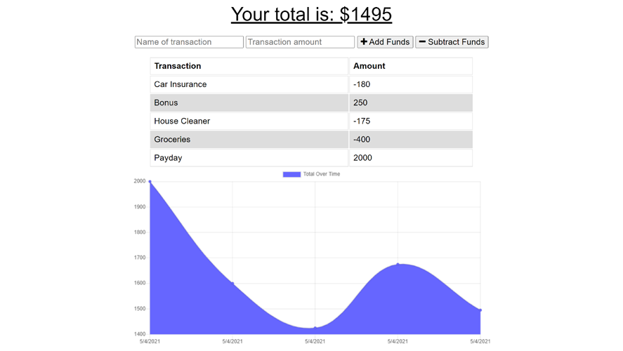

# Budget-Tracker

## Description

An application that allows a user to manage their expenses, whether they are online or offline.

Giving users a fast and easy way to track their money is important, but allowing them to access that information anytime is even more important.

## Table of Contents

- [Technolgies](#Technologies-Utilized)
- [Usage](#usage)
- [Credits](#credits)
- [License](#license)

## Technologies-Utilized

- [JavaScript](https://developer.mozilla.org/en-US/docs/Web/JavaScript)
- [Node.js](https://nodejs.org/en/)
- [express](https://expressjs.com/)
- [mongoDB](https://www.mongodb.com/2)
- [mongoose](https://mongoosejs.com/)
- [IndexedDB API](https://developer.mozilla.org/en-US/docs/Web/API/IndexedDB_API)

## Usage

- A user can perform the following

  - Add transactions by name, and the amount for that transaction
  - Select add funds or subtract funds.
  - The transaction will be added to the database
  - The transaction will be added to the list, and the graph will update to show transactions over time
  - If offline, perform the same activities as above:
    - The transaction will be added to the IndexedDB
    - When the user goes back online, all transactions in INdexedDB will push to database, and IndexedDB will clear

## Deployed Application Link

- [Deployed Link](https://budget-tracker-bah.herokuapp.com/)

- Screenshots of the application:

## Credits

- [bahuisken](https://github.com/bahuisken/)
- Lessons from University of Denver Fullstack Coding Bootcamp

## License

None

## Contributing

[Contributor Covenant](https://www.contributor-covenant.org/)

## Tests

Tested locally and on deployed link. In both scenarios, used Chrome Dev tools to simulate being offline. Transactions successfully pushed to IndexedDB data store, and then synced to database when coming back online.

## Questions

If you have any questions about the repo, open an issue or contact me directly at [brice.huisken@gmail.com](mailto:brice.huisken@gmail.com). You can find more of my work at [bahuisken](https://github.com/bahuisken/)
